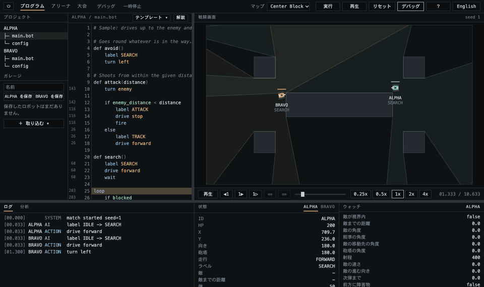
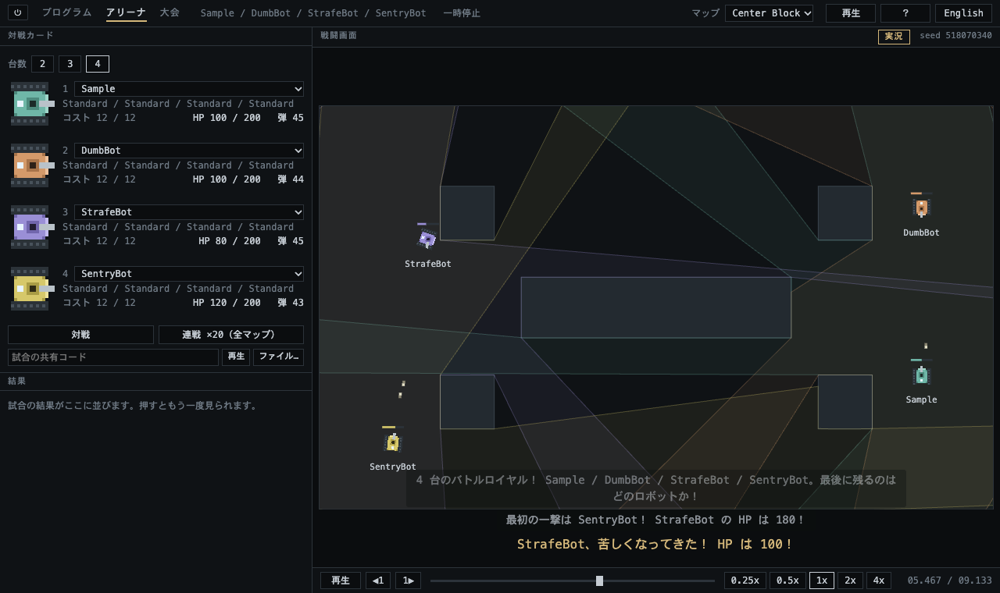
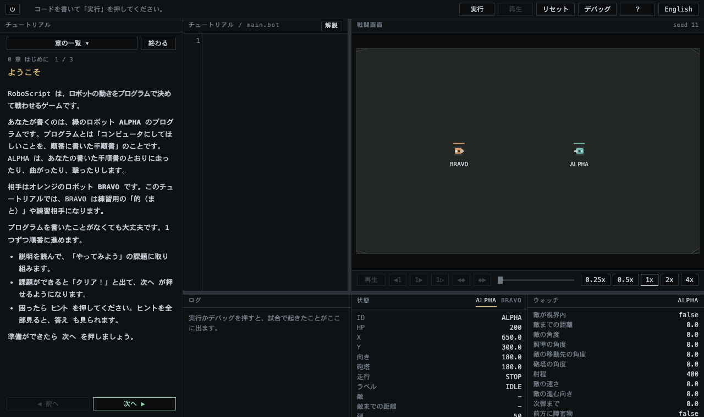
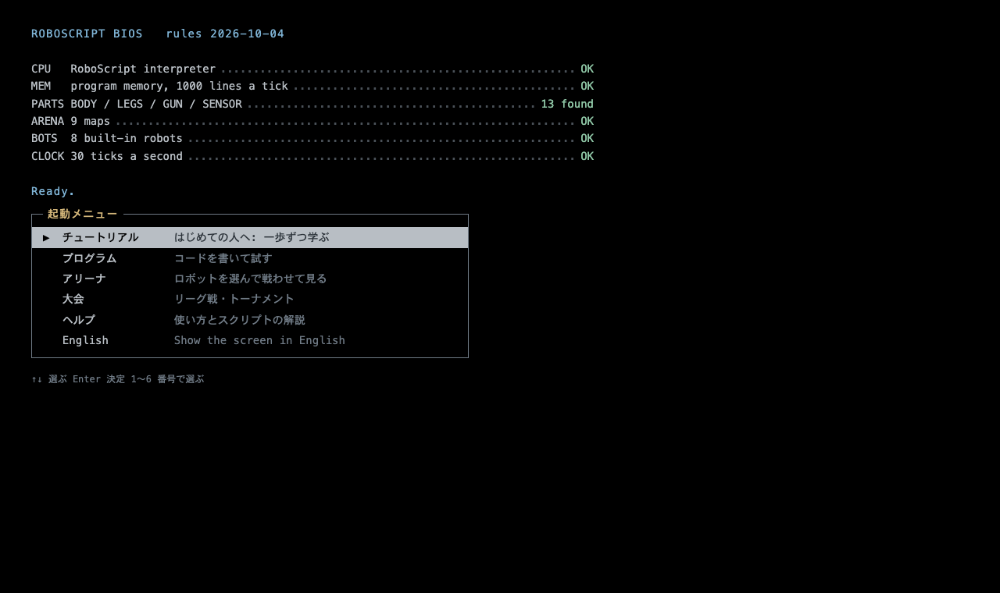

# RoboScript

ロボットの AI をプログラムで書いて、戦わせて、デバッグするゲームです。ブラウザで動きます。

*A game where you write your robot's AI in a small programming language, send it into battle, and debug it. Runs in the browser; the screen can be shown in English or Japanese.*

**遊ぶ / Play**: https://cheebow.github.io/roboscript/ （インストール不要。ブラウザで開くだけで遊べます）

**紹介 / About**: https://cheebow.github.io/roboscript/about.html ・ **ヘルプ / Help**: https://cheebow.github.io/roboscript/help.html （遊ぶ前に、中身とヘルプを読めます）



## どんなゲーム？

試合中にロボットを操作することはありません。ロボットがどう動くかは、試合の前に書いたプログラムがすべて決めます。

```
# 敵が見えたら、射程に入るまで近づいて撃つ
loop
    if enemy_visible and enemy_distance < weapon_range - 50
        drive stop
        aim enemy
        fire
    else
        turn enemy
        drive forward
```

- **RoboScript**: ロボットを動かすための小さな言語です。`if` / `loop` / `while` / 変数 / 関数があり、センサーで敵や弾や隠れ場所を調べられます。プログラムは上から順に流れ、行動を 1 つ実行するたびに 1 tick（1/30 秒）進みます。
- **デバッガ**: 試合を最後まで記録してから再生するので、1 行ずつ進めたり戻したり、ステップオーバーしたりできます。行番号を押すと、その行が実行される瞬間へ飛び、実行された時点がシークバーに並びます。
- **パーツ**: 車体・脚・銃・センサーをコスト 12 の中で選び、プログラムに合ったロボットを組みます。
- **いつも同じ試合**: 同じロボット・同じマップ・同じ seed なら、必ず同じ試合になります（決定論的なシミュレーション）。

## 画面

| | |
|---|---|
|  |  |
| **アリーナ**: ロボットを選んで戦わせて見ます。2 台の対戦、3〜4 台のバトルロイヤル、全マップでの 20 連戦。試合には実況が付きます。 | **チュートリアル**: プログラミングが初めてでも、0〜10 章・38 ステップで一歩ずつ学べます。課題は試合で自動的に判定されます。 |

- **プログラム**: コードを書き、ALPHA 対 BRAVO で試合をして、デバッグします。入力候補、語の説明、エラーの波線があります。
- **チャレンジ**: 条件つきの課題が 16 問あります。行数や時間、残り HP などの条件を満たして、星を集めます。最後は、内蔵ロボットのどれにも 9 割以上勝つ最強ロボとの勝負です。
- **分析**: 試合ごとに、当たった数、ダメージ、HP の推移、当たった場所を見られます。デバッグ中は、各行が何回実行されたかも出ます。
- **チームバトル（城攻め）**: 1 本のプログラムで 1〜3 台のチームを動かし、自分の城を守りながら敵の城を落とします。`signal` の無線で連携し、機体ごとのウォッチでプロトコルをデバッグできます。チームは保存して、リンクで人に渡せます。
- **大会**: 3〜8 台を集めて、リーグ戦かトーナメントをします。結果は対戦表や勝ち抜き表で見られ、ファイルに保存して人に渡せます。
- **ガレージ**: できたロボットを名前を付けて保存します。
- **共有**: ロボットや試合を、共有リンク・共有コード・ファイル（`.roboscript.json`）で人に渡せます。リンクなら SNS に貼るだけで、開いた人のゲームにロボットが入ります。サーバーは使いません。
- **ヘルプ**: アプリの使い方と、スクリプトの解説（全部の語の一覧つき）を、いつでも画面の右に開けます。

起動すると、コンピュータの起動画面のようなメニューから始まります。



## 動かす

Node.js（npm）が必要です。

```sh
npm install
npm run dev        # 表示された URL をブラウザで開く
```

```sh
npm run build      # dist/ に出力する
npm run preview    # ビルドしたものを手元で開く
```

ビルドしたものは PWA になっていて、ブラウザから「アプリとしてインストール」でき、一度開けばオフラインでも動きます。

URL に `?seed=数値` を付けると、プログラムの画面の試合の seed を固定できます（同じ試合でコードの違いを比べるとき用）。

## テスト

```sh
npm test           # Vitest
npm run typecheck
npm run balance    # パーツのバランス表（数分かかる）
npm run results    # 内蔵ロボットの勝率と試合時間（数分かかる）
```

## 技術

- TypeScript、Vite
- 戦闘画面は Canvas 2D（ロボットの絵はコードの中のドットパターンから作る）
- エディタは CodeMirror 6
- テストは Vitest（画面の部品の一部は happy-dom）
- 保存はブラウザの localStorage

## 文書

- [`SPEC.md`](SPEC.md): ゲームの仕様（画面、試合のルール、パーツ、RoboScript の全部の語、デバッガ、共有の形式）
- [`IMPLEMENTATION_STATUS.md`](IMPLEMENTATION_STATUS.md): 実装の記録（設計、残課題、変更の履歴）

## ソースの構成

```text
src/
├─ sim/        試合そのもの（DOM に依存しない）
├─ ai/         RoboScript の解析・インタプリタ・入力候補
├─ debug/      試合の記録と再生
├─ arena/      試合・連戦・リーグ戦・トーナメント・実況
├─ tutorial/   チュートリアルの章と判定
├─ help/       ヘルプの本文
├─ data/       パーツ、マップ、内蔵ロボット、基本の値
├─ project/    保存（ガレージ、プロジェクト）
├─ share/      共有コードとファイル
├─ i18n/       日本語と英語
├─ ui/         画面
└─ view/       戦闘画面の描画
tests/         Vitest のテスト
```

## ライセンス

[MIT](LICENSE)
